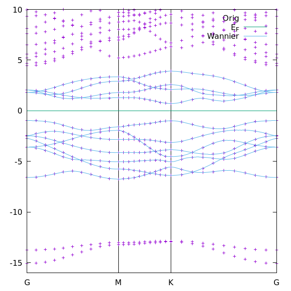

# Monolayer MoS<sub>2</sub> example

This example uses 11 orbital model for MoS<sub>2</sub>: 5 d-orbitals for Mo, and 3 p-orbitals for each S atom.

Generate k-mesh with *kmesh.pl* utility from /Wannier90/utility/ folder

> kmesh.pl 15 15 1

Insert generated k-mesh in *scf.in* input file and run QE

> pw.x < [scf.in](scf.in) > scf.out

Calculate the band structure with QE

> pw.x     < [bands.in](bands.in)  > bands.out

> bands.x  < [bandsx.in](bandsx.in) > bandsx.out

In *bands.in* we used automatic generation for high-symmetry k-points G-M-K-G:
```
K_POINTS crystal_b
4                           # total number of high-symmetry points
gG   10                     # point Gamma with 10 intermediate points to next high-symmetry point 
M    10
K    10
gG   1
```

In order to run Wannier90 we need again to calculate QE, because calculation of band structure destroys the QE data files:

> pw.x < scf.in > scf.out

In order to speed up this calculation we can start calculation from previous charge density:
```
&electrons
    startingpot = 'file'
/
```
 
In order to prepare input file for Wannier90 calculation, we need to insert the same k-mesh data as in QE input, which we generated with *kmesh.pl* utility. And in order the band structure k-path corresponds to QE k-path,we need to extract the k-path in reciplocal crystal_b coordinates from QE output, what actually QE generated:
```
begin kpoint_path
  G 0.0       0.0      0.0  M 0.5       0.0      0.0
  M 0.5       0.0      0.0  K 0.666667 -0.333333 0.0
  K 0.666667 -0.333333 0.0  G 0.0       0.0      0.0
end kpoint_path
```

For MoS<sub>2</sub> we use all orbitals for Mo and S atoms:
```
begin projections
Mo:d
S:p
end projections
```

The frozen energy zone contains all 11 bands:
```
dis_froz_min  = -7.8
dis_froz_max  =  4.0
```

Run Wannier90 preprocessing:

> wannier90.x -pp d

This run uses [d.win](d.win) input file.

Run pw2wannier90.x 

> pw2wannier90.x -in [pw2wan.in](pw2wan.in)

Run Wannier90 to calculate optimized Wannier functions and calculate band structure with Wannier functions: 

> wannier90.x d

This run uses the same input file [d.win](d.win)!

The output [d.wout](d.wout) contains information about disentalgment and optimization processes for Wannier functions.

File [d_hr.dat](d_hr.dat) contains the matrix elements of the Hamiltonian in Wannier basis H<sub>mn</sub>(R<sub>C</sub>). Line 2 and 3 contain information about total number of Wannier functions (3) and total number of matrix elements (15x15 = 225), next few lines contain degeneracy numbers, and then follow the matrix elements:
```
    i    j    k    m    n     Re Hmn      Im Hmn
   -9   -5    0    1    1    0.000207   -0.000000
   -9   -5    0    2    1   -0.000136   -0.000000
   -9   -5    0    3    1    0.000033   -0.000000
```
here i, j, k correspond to lattice cell R<sub>C</sub>, and m, n to Wannier function numbers.

To plot band structure:

> gnuplot [plot.gnu](plot.gnu)

The figure shows calculated band structure for 11 bands using 11 Wannier functions and comparison with QE band structure:


